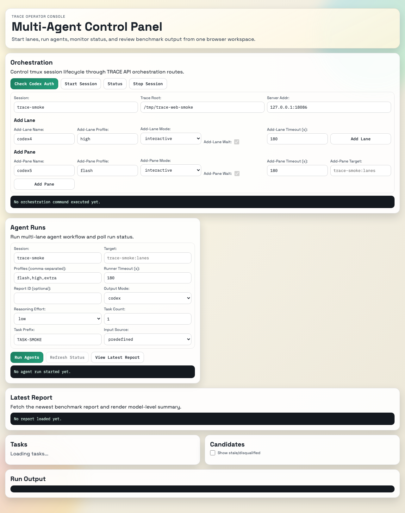
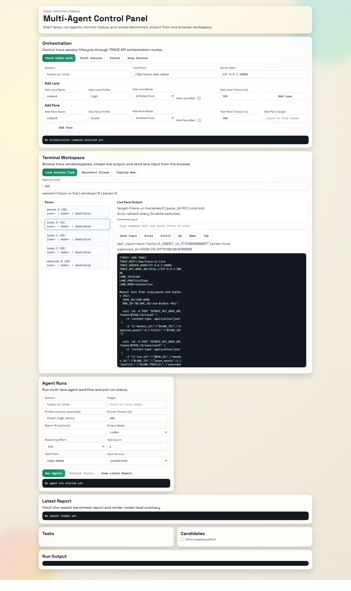

# TRACE
TRACE is a *local-first* harness that binds agent work to tasks, records immutable traces, versions outputs as ChangeSets, evaluates candidates deterministically, and supports recombination/stacking to pick a winner.

## UI Preview



## Active Planning Docs
- [AGENTS.md](/Users/artk/Documents/GitHub/TRACE/AGENTS.md)
- [BUILD_SEQUENCE_PLAN_v3.md](/Users/artk/Documents/GitHub/TRACE/BUILD_SEQUENCE_PLAN_v3.md)
- [SMOKETEST_EVAL_PLAN_v2.md](/Users/artk/Documents/GitHub/TRACE/SMOKETEST_EVAL_PLAN_v2.md)
- [FRONTEND_PLAN_v5.md](/Users/artk/Documents/GitHub/TRACE/FRONTEND_PLAN_v5.md)

## Phase 0 QA Docs
- [docs/PHASE0_SIGNOFF.md](/Users/artk/Documents/GitHub/TRACE/docs/PHASE0_SIGNOFF.md)
- [docs/PHASE0_HUMAN_QA.md](/Users/artk/Documents/GitHub/TRACE/docs/PHASE0_HUMAN_QA.md)
- [docs/LINUX_BUILD_HUMAN.md](/Users/artk/Documents/GitHub/TRACE/docs/LINUX_BUILD_HUMAN.md)

## Archived Planning Docs
- [archive/phase0_docs](/Users/artk/Documents/GitHub/TRACE/archive/phase0_docs)
- [archive/plan_refresh_2026-02-28/00_INDEX.md](/Users/artk/Documents/GitHub/TRACE/archive/plan_refresh_2026-02-28/00_INDEX.md)

## Workspace Layout
- Rust workspace crates live in `/Users/artk/Documents/GitHub/TRACE/crates`.
- Frontend package lives in `/Users/artk/Documents/GitHub/TRACE/web`.
- Canonical event log path is `.trace/events/events.jsonl`.

## Ubuntu LTS Build Guide (22.04/24.04)
1. Install OS packages:
```bash
sudo apt-get update
sudo apt-get install -y build-essential pkg-config libssl-dev curl git tmux jq ca-certificates
```
2. Install Rust toolchain (`rustup` + stable):
```bash
curl https://sh.rustup.rs -sSf | sh -s -- -y
source "$HOME/.cargo/env"
rustup toolchain install stable
rustup default stable
```
3. Install Node.js 20 LTS + pnpm:
```bash
curl -fsSL https://deb.nodesource.com/setup_20.x | sudo -E bash -
sudo apt-get install -y nodejs
corepack enable
corepack prepare pnpm@9 --activate
```
4. Install workspace dependencies:
```bash
cd /Users/artk/Documents/GitHub/TRACE
pnpm install
```
Detailed Ubuntu operator/runbook flow is documented in:
- [docs/LINUX_BUILD_HUMAN.md](/Users/artk/Documents/GitHub/TRACE/docs/LINUX_BUILD_HUMAN.md)

## Build + Test
1. Rust formatting gate:
```bash
rustup run stable cargo fmt --all --check
```
2. Rust lint gate:
```bash
rustup run stable cargo clippy --workspace --all-targets -- -D warnings
```
3. Rust workspace regression:
```bash
rustup run stable cargo test --workspace
```
4. Web regression:
```bash
pnpm --dir web test
pnpm --dir web build
```
5. Install Playwright browser runtime:
Linux:
```bash
pnpm --dir web exec playwright install --with-deps chromium
```
macOS:
```bash
pnpm --dir web exec playwright install chromium
```
6. Browser E2E:
```bash
pnpm --dir web test:e2e
```

## Local Run (Server + Web)
1. Start TRACE server:
```bash
TRACE_SERVER_ADDR=127.0.0.1:18086 \
TRACE_ROOT=/tmp/trace-web-smoke \
TRACE_CODEX_AUTH_POLICY=required \
cargo run -p trace-server
```
2. In another terminal, run web UI:
```bash
VITE_TRACE_API_BASE_URL=http://127.0.0.1:18086 pnpm --dir web dev --host 127.0.0.1 --port 4173
```
3. Open `http://127.0.0.1:4173` and use the **Orchestration** section:
   - `Check Codex Auth` (required before `Add Lane`/`Add Pane`)
   - `Start Session`
   - `Status`
   - `Add Lane` / `Add Pane` (`mode=runner` for scripted lane writes)
   - `Stop Session`
4. Use the **Terminal Workspace** section:
   - `Load Session Tree` (`POST /orchestrator/tmux/snapshot`)
   - select pane from list to stream output
   - pane output auto-refreshes via `POST /orchestrator/tmux/capture`
   - send pane input via:
     - command box + `Send Input`
     - shortcut buttons (`Enter`, `Ctrl+C`, `Up`, `Down`, `Tab`)
     - input keyboard shortcuts (`Enter`, `Ctrl+C`, `Ctrl+L`)
5. Use the **Agent Runs** section:
   - `Run Agents` (`POST /agent/runs`)
   - `Refresh Status` (`GET /agent/runs/{run_id}`)
   - active runs auto-poll until terminal status
   - runtime controls:
     - `Output Mode` (`codex` default, `scripted` optional)
     - `Reasoning Effort`
     - `Task Count` + `Task Prefix`
     - `Input Source` (`predefined` or `human`) with optional `Human Prompt`
   - `View Latest Report` (uses `GET /reports` + `GET /reports/{report_id}`)

## Web UI Status (2026-03-01)
- Current UI supports:
  - Codex auth preflight check.
  - tmux orchestration controls (`start`, `status`, `add-lane`, `add-pane`, `stop`).
  - tmux terminal workspace controls:
    - `Load Session Tree` (`/orchestrator/tmux/snapshot`)
    - pane selector and live pane capture (`/orchestrator/tmux/capture`)
    - pane input send (`/orchestrator/tmux/send-keys`) with command box + shortcut keys
  - Agent run controls (`Run Agents`, `Refresh Status`) with automatic active-run polling.
  - Runtime lane controls in Agent Runs panel:
    - `Output Mode` (`codex|scripted`)
    - `Reasoning Effort`
    - `Task Count`, `Task Prefix`
    - `Input Source` (`predefined|human`) and optional `Human Prompt`
  - Report retrieval/rendering flow (`View Latest Report`) with model summary table.
  - Read-only task/candidate/output views.
  - Playwright smoke baseline for auth -> agent run -> report flow.
  - Live pane-input proof screenshot:
    - `docs/tmux-terminal-workspace-proof.png`
  - CI Playwright scenario is API-stubbed for stability; real tmux/server verification is tracked in `docs/PHASE0_HUMAN_QA.md`.

## Codex Auth Policy + Preflight
TRACE exposes a Codex auth status endpoint and enforces auth at lane-spawn time.

- Auth status endpoint:
  - `GET /orchestrator/auth/codex/status`
- Lane-spawn enforcement:
  - `POST /orchestrator/tmux/add-lane`
  - `POST /orchestrator/tmux/add-pane`
- Policy env var:
  - `TRACE_CODEX_AUTH_POLICY=required|optional`
  - default is `required`
- Smoke history cap:
  - `TRACE_SMOKE_RUN_HISTORY_LIMIT` (default `200`)
- Codex binary override:
  - `TRACE_CODEX_BIN=/path/to/codex`

1. Check auth status:
```bash
curl -sS http://127.0.0.1:18086/orchestrator/auth/codex/status | jq .
```
2. If not logged in, authenticate with one of:
```bash
codex login
codex login --device-auth
printenv OPENAI_API_KEY | codex login --with-api-key
```
3. Re-check status and confirm when policy is `required`:
   - `policy="required"`
   - `available=true`
   - `logged_in=true`
4. Optional local bypass (not recommended for shared smoke tests):
```bash
TRACE_CODEX_AUTH_POLICY=optional cargo run -p trace-server
```

## Credential Handling And Safety
How credentials are handled on your machine:

- `codex login` (ChatGPT auth) stores credentials in `$CODEX_HOME/auth.json` (default `$HOME/.codex/auth.json`).
- `codex login --device-auth` is the same auth path, intended for SSH/headless hosts.
- `codex login --with-api-key` reads API key material from stdin (avoid putting raw keys in shell history).
- Codex can be configured to store credentials in OS keychain instead of `auth.json`:
```toml
# ~/.codex/config.toml
cli_auth_credentials_store = "keyring"
```
- TRACE does not read raw token values directly. TRACE only shells out to `codex login status` and receives status text (`logged_in`, auth method hints, remediation commands).
- Treat `auth.json` as secret material:
  - never commit it
  - do not copy it between users
  - prefer keychain storage on shared machines

References:
- https://developers.openai.com/codex/auth
- https://developers.openai.com/codex/cli

## Tmux Operator Runbook (CLI)
1. Start session:
```bash
scripts/trace-smoke-tmux.sh start
```
2. Verify session and panes:
```bash
scripts/trace-smoke-tmux.sh status
```
3. Validate pane target before smoke workflow:
```bash
scripts/trace-smoke-tmux.sh validate-target trace-smoke:lanes
```
4. Optional runner lane spawn:
```bash
scripts/trace-smoke-tmux.sh add-pane codex5 flash trace-smoke:lanes runner
```
5. Stop session:
```bash
scripts/trace-smoke-tmux.sh stop
```

## Tmux Workspace API Contract
`POST /orchestrator/tmux/snapshot`

Request JSON:
- `session` optional string, default `trace-smoke`.

Behavior:
- Runs tmux snapshot command scoped to the requested session.
- Returns structured session metadata for UI pane browsing.

Success response:
- HTTP `200 OK`.
- Returns:
  - `session`
  - `windows[]` (`window_index`, `window_name`, `window_id`, `active`)
  - `panes[]` (`pane_id`, `session`, `window_index`, `window_name`, `pane_index`, `target`, `title`, `lane_name`, `lane_mode`, `active`, `dead`, `dead_status`, `pid`, `command`)
  - `config` (`trace_root`, `trace_server_addr`, `runner_output_mode`, `runner_task_count`, `runner_task_prefix`, `runner_reasoning_effort`)

`POST /orchestrator/tmux/capture`

Request JSON:
- `session` optional string, default `trace-smoke`.
- `target` required tmux target token (supports pane ids like `%1`).
- `lines` optional integer in `[1, 5000]`, default `200`.

Behavior:
- Captures read-only pane text using tmux capture.
- Does not execute commands or forward keyboard input.

Success response:
- HTTP `200 OK`.
- Returns:
  - `session`, `target`, `lines`, `captured_at`, `content`

`POST /orchestrator/tmux/send-keys`

Request JSON:
- `session` optional string, default `trace-smoke`.
- `target` required tmux target token (supports pane ids like `%1`).
- `text` optional text payload (max 4000 chars).
- `key` optional key token from allowlist:
  - `Enter`, `Tab`, `BSpace`, `Escape`, `Up`, `Down`, `Left`, `Right`, `C-c`, `C-z`, `C-l`, `C-u`
- `press_enter` optional bool; when true, sends Enter after text/key.

Behavior:
- Sends input to the target pane using tmux `send-keys`.
- Requires at least one input action: `text`, `key`, or `press_enter=true`.

Success response:
- HTTP `200 OK`.
- Returns standard tmux command payload:
  - `command`, `exit_code`, `stdout`, `stderr`

## Agent Run API Contract
`POST /agent/runs`
  - Legacy alias still accepted: `POST /smoke/runs`

Request JSON:
- `session` optional string, default `trace-smoke`.
- `profiles` optional array of profile tokens, default `["flash","high","extra"]`.
- `target` optional string, default `<session>:lanes`.
- `runner_timeout_sec` optional integer in `[1, 3600]`, default `180`.
- `report_id` optional string, sanitized server-side for report filenames.
- `runner_output_mode` optional enum: `codex | scripted` (runner default is `codex`).
- `runner_task_count` optional integer in `[1, 50]`.
- `runner_task_prefix` optional token `[A-Za-z0-9._-]+`.
- `runner_reasoning_effort` optional token `[A-Za-z0-9._-]+`.
- `runner_codex_prompt` optional free text (max 4000 chars).

Behavior:
- Enforces Codex auth policy for lane spawn.
- Preflights tmux session via `status`.
- Preflights tmux target via `validate-target`.
- Rejects concurrent active run per tmux session.
- Bounds in-memory run history via `TRACE_SMOKE_RUN_HISTORY_LIMIT` (default `200`).
- Passes runner knobs through tmux lane spawn env:
  - `TRACE_RUNNER_OUTPUT_MODE`
  - `TRACE_RUNNER_TASK_COUNT`
  - `TRACE_RUNNER_TASK_PREFIX`
  - `TRACE_RUNNER_CODEX_REASONING_EFFORT`
  - `TRACE_RUNNER_CODEX_PROMPT`

Success response:
- HTTP `202 Accepted`.
- Returns queued `AgentRunResponse` with:
  - `run_id`, `status`, `current_step`, `session`, `target`, `profiles`, `lane_names`.

`GET /agent/runs/{run_id}`
- Legacy alias still accepted: `GET /smoke/runs/{run_id}`
- Returns current `AgentRunResponse`.
- Terminal success includes:
  - `report_id`, `json_report_path`, `markdown_report_path`, `summary`.
- Missing run id returns HTTP `404`.

Agent run states:
- `queued` -> `running` -> (`succeeded` | `failed`)
- Common `current_step` values:
  - `queued`
  - `spawning_lanes`
  - `waiting_for_lanes`
  - `evaluating_benchmark`
  - `completed`

## Report Retrieval API Contract
`GET /reports`

Query:
- `limit` optional integer in `[1, 200]`, default `50`.

Behavior:
- Reads reports from `.trace/reports/*.json`.
- Ignores non-JSON files (for example `.md` artifacts).
- Returns latest-first ordering by `generated_at` (RFC3339 parse, then `report_id` tie-breaker).

Success response:
- HTTP `200 OK`.
- Returns `{ "reports": [ ... ] }` with each item including:
  - `report_id`, `generated_at`, `total_events`, `total_tasks`, `total_runs`, `models`.

`GET /reports/{report_id}`
- `report_id` must match `[A-Za-z0-9_-]+` (strict identifier token, not a path).
- Returns full benchmark report JSON payload for that `report_id`.
- Missing report returns HTTP `404`.
- Invalid `report_id` format returns HTTP `400`.

## API Smoke (No Browser)
```bash
curl -sS http://127.0.0.1:18086/orchestrator/auth/codex/status | jq .

curl -sS -X POST http://127.0.0.1:18086/orchestrator/tmux/start \
  -H 'content-type: application/json' \
  -d '{"session":"trace-web-smoke","trace_root":"/tmp/trace-web-smoke","addr":"127.0.0.1:18086"}'

curl -sS -X POST http://127.0.0.1:18086/orchestrator/tmux/status \
  -H 'content-type: application/json' \
  -d '{"session":"trace-web-smoke"}'

curl -sS -X POST http://127.0.0.1:18086/orchestrator/tmux/snapshot \
  -H 'content-type: application/json' \
  -d '{"session":"trace-web-smoke"}' | jq .

curl -sS -X POST http://127.0.0.1:18086/orchestrator/tmux/capture \
  -H 'content-type: application/json' \
  -d '{"session":"trace-web-smoke","target":"trace-web-smoke:lanes.0","lines":120}' | jq .

curl -sS -X POST http://127.0.0.1:18086/orchestrator/tmux/send-keys \
  -H 'content-type: application/json' \
  -d '{"session":"trace-web-smoke","target":"trace-web-smoke:lanes.0","text":"echo from browser","press_enter":true}' | jq .

scripts/trace-smoke-tmux.sh --session trace-web-smoke validate-target trace-web-smoke:lanes

RUN_ID="$(curl -sS -X POST http://127.0.0.1:18086/agent/runs \
  -H 'content-type: application/json' \
  -d '{"session":"trace-web-smoke","target":"trace-web-smoke:lanes"}' | jq -r '.run_id')"

while true; do
  STATUS="$(curl -sS "http://127.0.0.1:18086/agent/runs/$RUN_ID" | tee /tmp/trace-agent-run.json | jq -r '.status')"
  if [[ "$STATUS" == "succeeded" || "$STATUS" == "failed" ]]; then
    break
  fi
  sleep 1
done

cat /tmp/trace-agent-run.json | jq .

curl -sS http://127.0.0.1:18086/reports?limit=1 | jq .

curl -sS -X POST http://127.0.0.1:18086/orchestrator/tmux/stop \
  -H 'content-type: application/json' \
  -d '{"session":"trace-web-smoke"}'
```

Note:
- `/reports` APIs are implemented and are the supported browser retrieval path.
- `json_report_path` / `markdown_report_path` are still returned by agent run status for operator debugging.

## Troubleshooting
- `412 Precondition Failed` on `add-lane`/`add-pane`:
  - Codex auth policy is `required` and `codex login status` is not logged in.
- `409 Conflict` from `POST /agent/runs` with `agent run already active`:
  - Another agent run is already active for that tmux session.
- `409 Conflict` from `POST /agent/runs` mentioning `status`:
  - tmux session preflight failed; start session first.
- `409 Conflict` from `POST /agent/runs` mentioning `validate-target`:
  - target pane/window does not exist; validate or adjust target.
- `409 Conflict` from `POST /orchestrator/tmux/snapshot` or `/capture`:
  - tmux session missing or pane target not found.
- `400 Bad Request` from `POST /orchestrator/tmux/capture`:
  - invalid `target` token or `lines` outside `[1, 5000]`.
- `400 Bad Request` from `POST /orchestrator/tmux/send-keys`:
  - missing input action (`text`/`key`/`press_enter=true`), invalid `key`, or oversized/empty `text`.
- `409 Conflict` mentioning `history limit reached`:
  - increase `TRACE_SMOKE_RUN_HISTORY_LIMIT` or wait for terminal runs to be pruned.
- `400 Bad Request` on smoke start:
  - invalid token characters in `session`/`profiles`/`target`/`runner_task_prefix`/`runner_reasoning_effort`, invalid `runner_timeout_sec`, invalid `runner_task_count`, or oversized/empty `runner_codex_prompt`.
- Synthetic vs real output:
  - `runner_output_mode=codex` produces real Codex-generated lane output.
  - `runner_output_mode=scripted` is intentionally synthetic plumbing output.
- TODO (scripted mode hardcoding):
  - Replace hardcoded scripted output text with markdown-driven instructions (for example, per-run `*.md` prompt input from UI/API) so scripted mode can exercise user-authored agent instructions instead of fixed placeholder content.

## Current Status
- Monorepo scaffold is in place (Rust + TypeScript workspace).
- Read-side API projections from canonical event log are implemented.
- tmux orchestration routes are implemented in backend and wired into web UI controls.
- tmux workspace read APIs are implemented:
  - `POST /orchestrator/tmux/snapshot`
  - `POST /orchestrator/tmux/capture`
- tmux pane input API is implemented:
  - `POST /orchestrator/tmux/send-keys`
- Smoke workflow API is implemented:
  - `POST /agent/runs` (legacy alias: `/smoke/runs`)
  - `GET /agent/runs/{run_id}` (legacy alias: `/smoke/runs/{run_id}`)
- Report retrieval APIs are implemented:
  - `GET /reports`
  - `GET /reports/{report_id}`
- Web UI now supports tmux pane browsing + live capture + pane input send, agent run trigger/poll, and latest report retrieval/rendering.
- Playwright E2E smoke is implemented and CI-gated.
- Phase 0 sign-off artifacts are tracked under:
  - [docs/PHASE0_SIGNOFF.md](/Users/artk/Documents/GitHub/TRACE/docs/PHASE0_SIGNOFF.md)
  - [docs/PHASE0_HUMAN_QA.md](/Users/artk/Documents/GitHub/TRACE/docs/PHASE0_HUMAN_QA.md)
- Next milestone is deterministic seeded eval/scoring contract.

## Immediate Blocker-Removal Plan
1. Execute and record human QA sign-off run using:
   - [docs/PHASE0_HUMAN_QA.md](/Users/artk/Documents/GitHub/TRACE/docs/PHASE0_HUMAN_QA.md)
   - [docs/PHASE0_SIGNOFF.md](/Users/artk/Documents/GitHub/TRACE/docs/PHASE0_SIGNOFF.md)
2. Add deterministic seeded eval pack so scores are stable.
3. Add merge/PR output pipeline after smoke stability.
